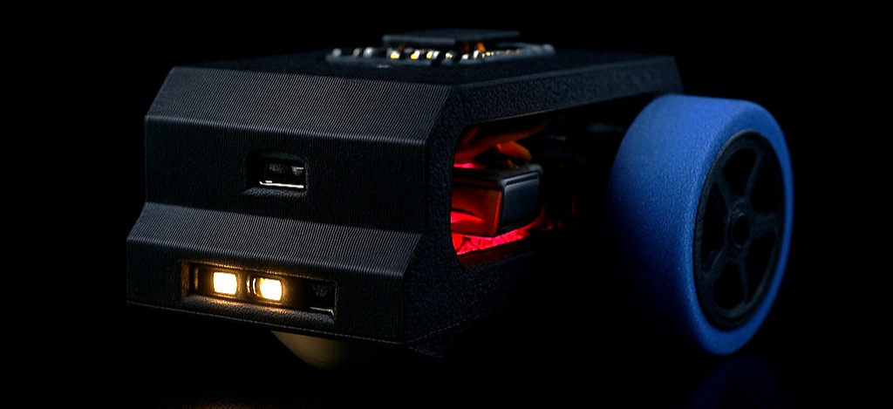
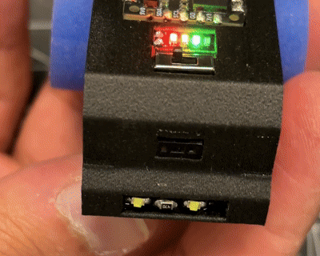

## LokaBot


*AI render*

Loka is designed as a simple but complete robot for learning robotics.  
It shows how a robot can sense, decide, and act using only a few parts.  
The design is small, low cost, and easy to build, yet it covers the main topics: sensing, control, and motion.


<p align="center">
  
</p>


### Key Ideas

- One VL53L7CX sensor is split into left, middle, and right zones for navigation.  
  This replaces the need for multiple distance sensors.  
- A custom library (`Loka`) makes all sensors work with simple commands.  
  Instead of using three separate libraries, everything is unified.  
- The body is fully 3D printed and uses **press-fit assembly without screws**,  
  making it easy to build even for beginners.  

The goal is to create a robot that is easy for students and hobbyists,  
but also shows good engineering choices for more advanced users.

## Features

- Zone based obstacle avoidance with VL53L7CX  
- Ambient light and proximity sensing with VCNL4040
- Orientation, gyro, and tap detection with BNO085 IMU  
- Simple motor control API for left and right motors (coming soon)  
- One piece 3D printed body and custom wheels  
- Press-fit slots for motor driver and ToF sensor (no screws needed)  
- DIY silicone tires for better grip  
- USB-C charging and onboard LiPo battery support


<p align="center">
  
</p>


## Hardware

Loka is built with a mix of custom 3D printed parts and standard components.  
The design keeps the part count low while still covering the essentials.

- **CodeCell board** (ESP32-C3 with onboard VCNL4040 light sensor and BNO085 IMU)  
- **VL53L7CX time of flight sensor** for 4×4 or 8×8 distance zones  
- **Two N10 DC motors (140 RPM)** with DRV8833 motor driver  
- **LiPo battery**: 200 mAh tested, 400 mAh recommended for longer runtime  
- **LED battery indicator module**  
- **Mini power switch with LED**  
- **One piece 3D printed body** and **custom wheels**  
- **DIY silicone tires** molded to fit the printed wheels  
- **Front caster ball** made from a small perfume roller ball

Detailed sourcing links are provided in the `hardware/` folder.

## Software

The Loka library brings all sensors and controls into one simple API.  
It wraps the original SparkFun drivers and makes them easier to use.  
Instead of three different libraries, you only need `Loka`.

### Supported

- **IMU (BNO085)**: orientation, gyro, tap detection  
- **Light sensor (VCNL4040)**: ambient and proximity sensing, auto headlight control  
- **Time of Flight (VL53L7CX)**: multi-zone ranging, split into Left / Middle / Right  
- **Motors**: simple control API for left and right motors *(coming soon)*


<p align="center">
  
</p>


### Core Classes

- `LokaMCU` → IMU and light  
- `LokaToF` → time of flight distance sensing  
- `LokaMotors` → motor control  

### Example

```cpp
#include <Loka.h>

LokaMCU mcu;
LokaToF tof;

void setup() {
  Serial.begin(115200);
  mcu.Init(LIGHT + ROT + GYR + TAP);   // enable IMU + Light
  tof.Init(Z16);           // ToF in 4×4 mode
}

void loop() {
  mcu.Run();               // update IMU + Light
  tof.Run(10);             // update ToF at 10 Hz

  mcu.PrintIMU();
  mcu.PrintLight();

  // ToF printing
  tof.PrintZones();        // full grid
  tof.PrintZonesAvg();     // averages: Left | Middle | Right
  delay(100);
}
```

## Examples

Quick demos are included in the `examples/` folder.  
Here are short versions to get started:

### Time of Flight (VL53L7CX)
```cpp
#include <Loka.h>
LokaToF tof;

void setup() {
  Serial.begin(115200);
  tof.Init(Z16);   // choose 4×4 or 8×8
  tof.Left();      // default groups
  tof.Middle();
  tof.Right();
}

void loop() {
  tof.Run(30);
  tof.PrintZonesAvg();   // L | M | R averages
  delay(100);
}
```

### Light (VCNL4040)
```cpp
#include <Loka.h>
LokaMCU loka;

void setup() {
  Serial.begin(115200);
  loka.Init(LIGHT);
  loka.SetDarkLED(1, 250, true, AMB);  // auto headlight
}

void loop() {
  loka.Run(20);
  loka.Light(amb);
  loka.PrintLight();
}
```

### IMU (BNO085)
```cpp
#include <Loka.h>
LokaMCU loka;

void setup() {
  Serial.begin(115200);
  loka.Init(ROT + GYR + TAP);
  loka.TapSens(3);   // sensitivity
}

void loop() {
  loka.Run(25);
  loka.Rot(y, r);
  loka.Gyro(gx, gz);
  if (loka.TapRead()) Serial.println("Tap detected");
  loka.PrintIMU();
}
```

## Getting Started

1. **Install ESP32 boards**  
   In Arduino IDE → `Tools > Board > Board Manager` → search **esp32** → install by *Espressif Systems*.  
   Select **ESP32C3 Dev Module** and set `USB CDC On Boot` = **Enabled**.

2. **Install the library**  
   Download ZIP from the green **Code** button → Arduino IDE →  
   `Sketch > Include Library > Add .ZIP Library...`
    or  
   Clone the repo directly:  
   ```bash
   git clone https://github.com/faajmid/Loka.git
   ```

4. **Run an example**  
   Open `File > Examples > Loka > ToF` (or Light, IMU), upload, and check Serial Monitor.

## Roadmap

- Loka core library  
- Time-of-Flight sensor (VL53L7CX)  
- Light sensor (VCNL4040)  
- IMU (BNO085)  
- Motor control (N10 DC motors + DRV8833)  
- Assembly guide with 3D files and tire molding  
- Extra examples (obstacle avoidance, following, IMU actions)

## License

This project is licensed under the MIT License.  
See the [LICENSE](LICENSE) file for details.

