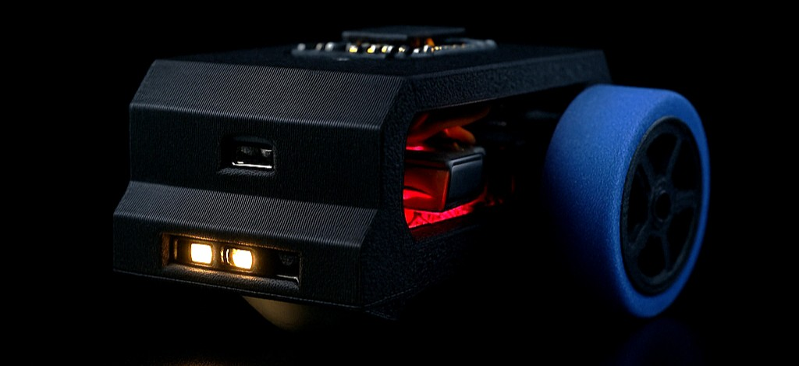

# LokaBot

LokaBot is an open-source, palm-sized autonomous robot built around the **Microbots CodeCell C3**, a **DRV8833 dual motor driver**, and a **VL53L7CX multi-zone time-of-flight sensor**.

The project focuses on compact mechanical design, wiring, assembly, and practical robotics experiments. It intentionally uses trusted upstream Arduino libraries instead of maintaining a separate Loka software library.

<p align="center">
  
</p>

<p align="center">
  
</p>

## Highlights

- 51 × 28 × 23 mm body, or approximately 51 × 54 × 23 mm with wheels
- CodeCell C3 with ESP32-C3, BNO085 IMU, VCNL4040 light/proximity sensor, USB-C, and LiPo charging
- VL53L7CX 4×4 or 8×8 multi-zone distance sensing
- Two N10 3 V DC motors driven by a DRV8833
- Screw-free, press-fit 3D-printed body
- Silicone tires cast using a printable mold
- Three standalone Arduino examples based on maintained upstream libraries

## Repository structure

```text
Loka/
├── examples/
│   ├── CodeCell_All_Sensors/
│   ├── CodeCell_Motors/
│   └── SparkFun_ToF/
├── hardware/
│   ├── 3D/
│   ├── images/
│   └── README.md
├── images/
├── LICENSE
└── README.md
```

## Hardware and assembly

The complete bill of materials, pin table, wiring diagram, printing notes, and assembly guide are in [hardware/README.md](hardware/README.md).

## Required Arduino software

Install these using **Arduino IDE → Library Manager**:

1. **CodeCell** by Microbots
2. **SparkFun VL53L5CX Arduino Library** by SparkFun Electronics

Install **esp32 by Espressif Systems** using Boards Manager.

Recommended board settings for CodeCell C3:

- Board: `ESP32C3 Dev Module`
- USB CDC On Boot: `Enabled`
- CPU Frequency: `160 MHz`
- Flash Size: `4 MB`

## Examples

### 1. CodeCell all sensors

`examples/CodeCell_All_Sensors/CodeCell_All_Sensors.ino`

Uses the official CodeCell library to read the onboard light/proximity sensor, IMU rotation, gyroscope, accelerometer, tap detector, motion state, battery level, and power state.

### 2. CodeCell motor control

`examples/CodeCell_Motors/CodeCell_Motors.ino`

Uses the official CodeCell GPIO/PWM functions to control the external DRV8833 and both N10 motors. Confirm the four motor-control pins against the wiring table before uploading.

### 3. SparkFun multi-zone ToF

`examples/SparkFun_ToF/SparkFun_ToF.ino`

Uses SparkFun's maintained VL53L5CX Arduino library to initialize the VL53L7CX-compatible multi-zone sensor interface, read a 4×4 distance frame, and print it as a grid.

> The SparkFun library is named after the VL53L5CX. LokaBot's sensor is documented as VL53L7CX. Confirm the exact breakout-board revision and library compatibility before final hardware testing.

## First power-up checklist

1. Inspect for shorts and reversed battery polarity.
2. Power the CodeCell from USB without the motors connected.
3. Upload the all-sensors example and verify serial output.
4. Connect the ToF sensor and run the ToF example.
5. Raise the robot so its wheels are clear of the table.
6. Connect the DRV8833 and motors, then run the motor example at low duty cycle.
7. Reverse a motor's two wires if its physical direction is opposite to the expected direction.

## Project status

The mechanical design and hardware documentation are the primary deliverables. The example sketches are reference tests and starting points for navigation, obstacle avoidance, light following, and IMU-based behavior.

## Attribution

- CodeCell hardware and Arduino library: Microbots
- SparkFun VL53L5CX Arduino Library: SparkFun Electronics
- LokaBot mechanical design, integration, documentation, and project examples: Fahad Al Ajmi

## License

LokaBot project files are released under the MIT License. Third-party libraries retain their original licenses and are installed separately rather than copied into this repository.
