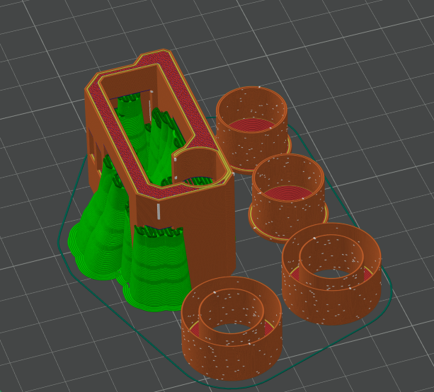

# Loka Hardware

This folder contains all 3D printable parts and hardware details for the LokaBot.

## Bill of Materials (BOM)
| Part | Spec / Model | Qty | Notes |
|---|---|---:|---|
| MCU board | CodeCell ESP32-C3 with VCNL4040 + BNO085 | 1 | USB-C, onboard sensors |
| ToF sensor | VL53L7CX breakout | 1 | Board size ~**6.4×3.0×1.6 mm** (check fits body slot) |
| Motors | N10 DC **3V** ~298 RPM | 2 | **3 mm D-shaft** (matches hub) |
| Motor driver | DRV8833 | 1 | Dual H-bridge |
| Battery | LiPo 1S 3.7 V **200–400 mAh** | 1 | Choose a size that fits the body cavity |
| Switch | Mini **slide** switch (SS12D00G3) | 1 | Panel mount |
| Battery indicator module | 1S LED indicator | 1 | Board size ~**5×9.5 mm** |
| Caster ball | Small perfume **roller ball** 10 mm | 1 | Front support |
| Wires | **30 AWG** flexible silicone wire (5 colors) | 1 | Keep motor leads short |
| 3D parts & CAD | Body, wheel hubs, tire mold | – | See [`3D`](3D) folder, includes `.3mf` files for printing and [`LokaBot.step`](3D/LokaBot.step) for editing |
| Silicone rubber | **DoYB Mold Making A30, 1:1 mix** | 1 | For casting tires; syringe fill recommended |

## Printing Notes
- Recommended material: PLA or PLA-CF for body and hubs.  
- Tire mold can be printed with standard PLA.  
- Print all parts **as-is**, with support enabled for the body.  
- Tree supports are preferred.  

Example slicer view:  
   

  

## Wiring Diagram

  

## Assembly
> Before assembly: Trim the screw hole edges of the VL53L7CX breakout board.  
> This creates sharp edges so the board press-fits perfectly into the body slot.

1. Print all `.3mf` files at 0.2 mm layer height (or finer).  
2. Press fit the motors, board, and sensor into the body.  
3. Use the tire mold with silicone to create soft rubber tires.  
4. Attach the caster ball in the front slot.  

## Casting Silicone Tires
Mix equal parts A and B silicone (1:1 ratio).  
For each pair of tires, prepare ~12 g of A and ~12 g of B.  

### Steps
1. Measure ~12 g of each part, mix thoroughly, and fill syringe.
   

  

2. Pour into the 3D printed hub and let cure for 4 hours.   

   

  

> **Note:** Remove the tire by squeezing the mold to break it open *(designed for easy release)*.  

### Final Result
Soft wheels with excellent grip.  
     

  

  
    

  

