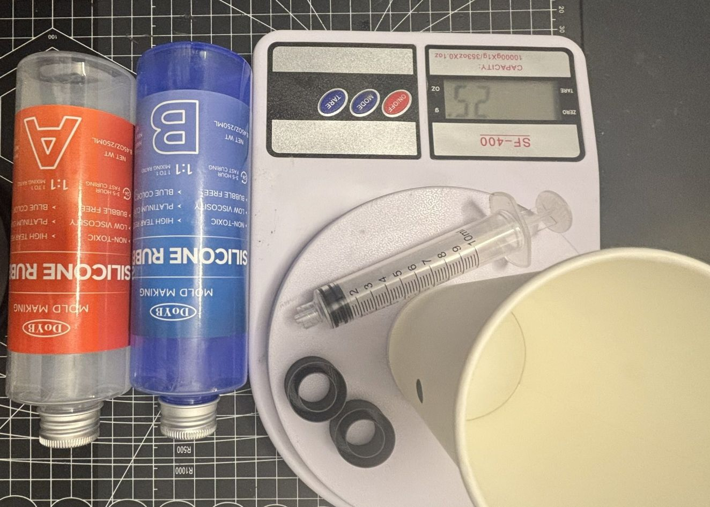
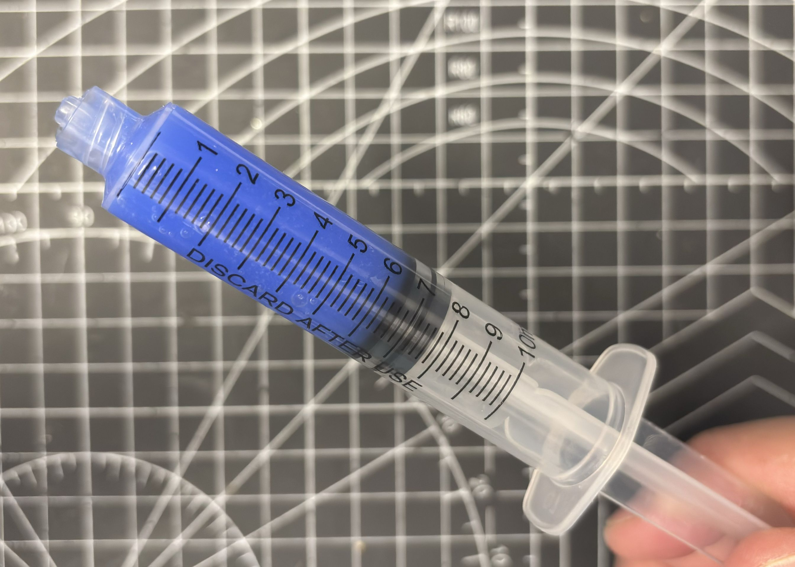
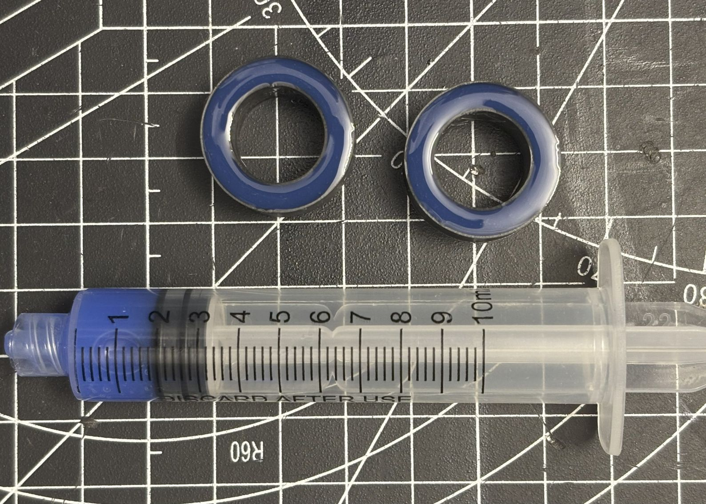
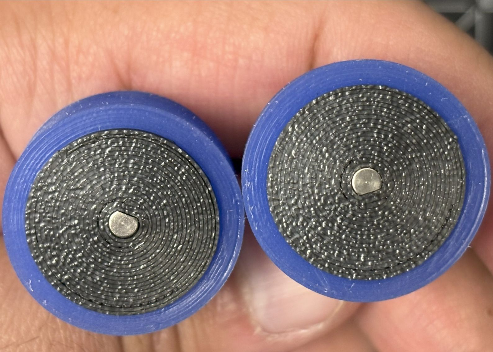
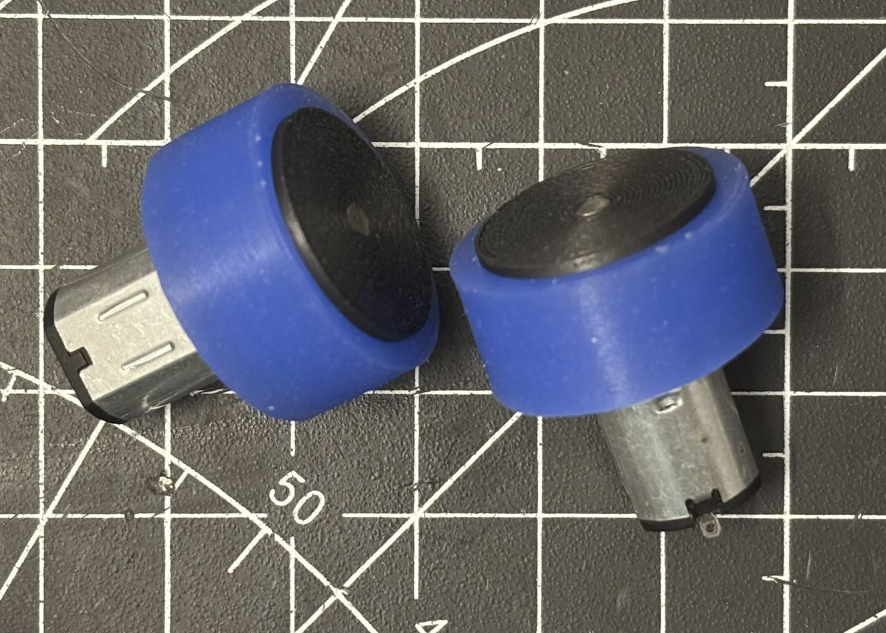

# Loka Hardware

This folder contains all 3D printable parts for the LokaBot.

## Bill of Materials (BOM)

| Part | Spec / Model | Qty | Notes |
|---|---|---:|---|
| MCU board | CodeCell ESP32-C3 with VCNL4040 + BNO085 | 1 | USB-C, onboard sensors |
| ToF sensor | VL53L7CX breakout | 1 | Dimensions 6.4x3.0x1.6 mm |
| Motors | N10 DC **6 V** ~200–300 RPM | 2 | **3 mm D-shaft** (matches hub) |
| Motor driver | DRV8833 | 1 | Dual H-bridge |
| Battery | LiPo 1S 3.7 V **200–400 mAh** | 1 | Choose size that fits body cavity |
| Switch | Mini **slide** switch (SS12D00G3) | 1 | Panel mount |
| Battery indicator module | 1S LED bar/indicator | 1 | Size 5x9.5 mm |
| Caster ball | Small perfume **roller ball** | 1 | Front support |
| Wires | **30 AWG** 5 Colors Flexible Silicone Wire | 1 | Keep motor leads short |
| 3D parts | Body, wheel hubs, tire mold | – | In `Loka/hardware/3D/` (print body **with supports**) |
| Silicone rubber | **RTV-2 platinum cure, Shore A 30, 1:1 | 1 | For casting tires; syringe fill recommended |

## Parts
- **Body** – main chassis designed for press fit assembly (no screws needed).
- **Wheel Hub** – 3D printed hubs for N10 motors (D Shaft).
- **Tire Template** – mold for casting silicone or rubber tires.

## Printing Notes
- Recommended material: PLA or PLA-CF for body and hubs.  
- Tire mold can be printed with standard PLA.  
- Print all parts **as-is**, with support enabled for the body.  
- Tree supports are preferred.  

Example slicer view:  

## Assembly
1. Print all 3mf files at 0.2 mm layer height (or finer).
2. Press fit the motors, board, and sensor into the body.
3. Use the tire mold with silicone (1:1 ratio) to create soft rubber tires.
4. Attach the castor ball in the front slot.

## Casting Silicone Tires

Mix equal parts A and B silicone (1:1 ratio).  
For each pair of tires, prepare ~12g of A and ~12g of B.  

### Steps
1. Measure parts ~12g of A and ~12g of B.  
   

2. Fill syringe and pour into 3D printed hub.  
   

3. Let cure for 4 hours.  
   

4. Final result – soft wheels with excellent grip.  
     
   
