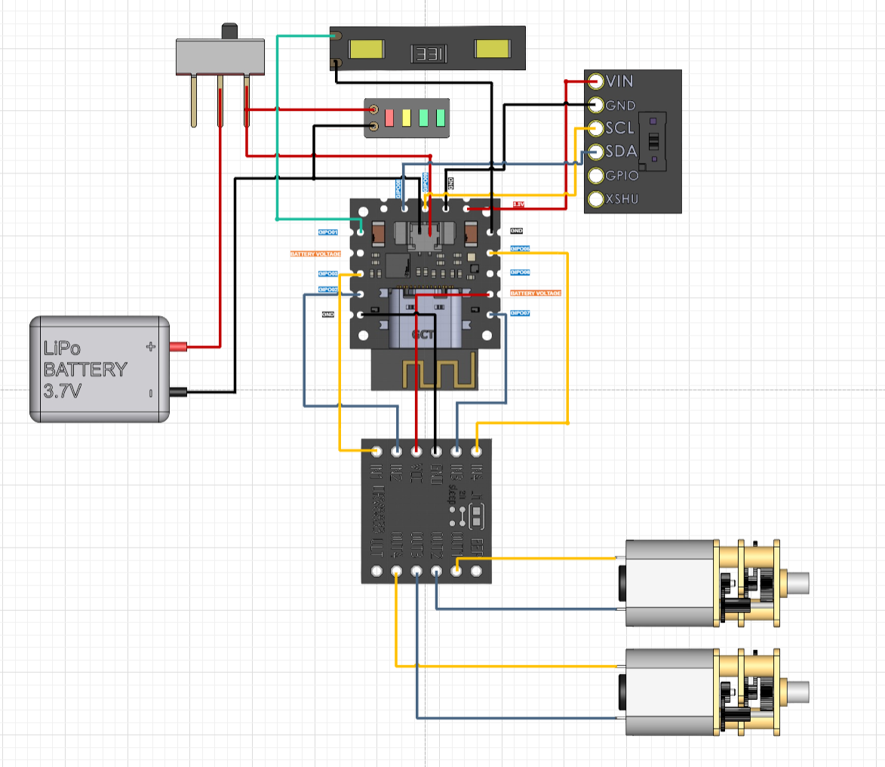
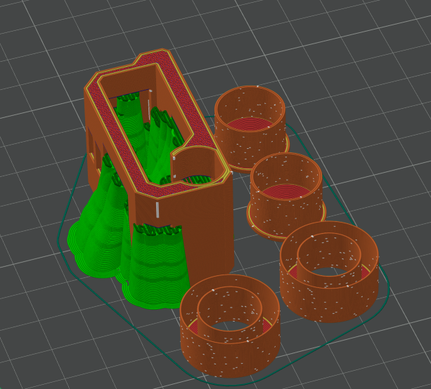
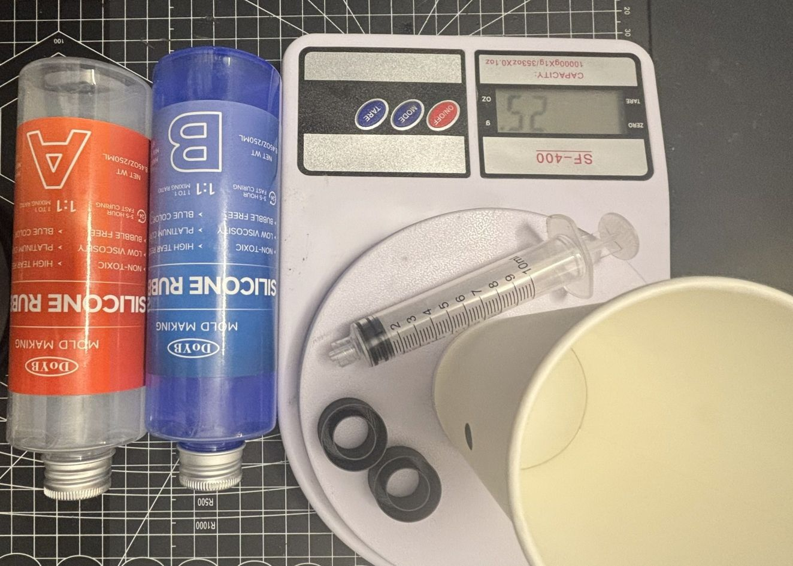
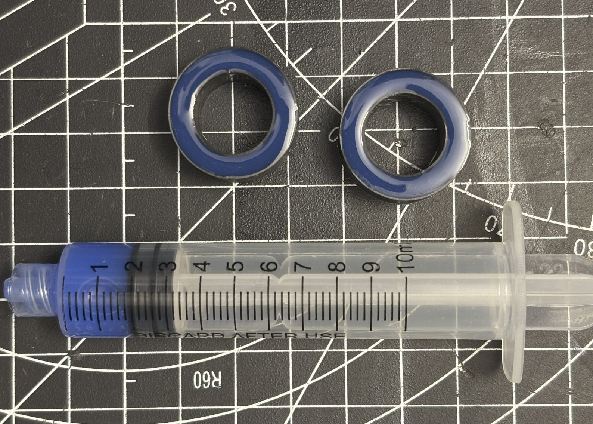
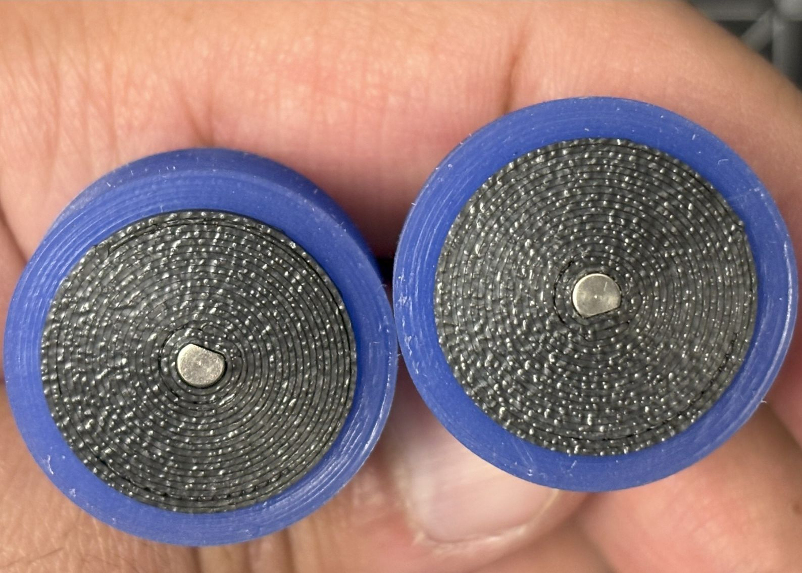
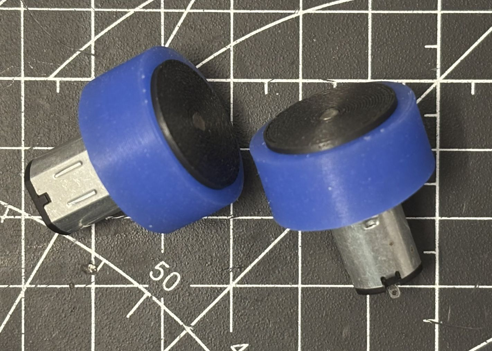

# LokaBot Hardware Guide

LokaBot is a compact two-wheel robot built around the **Microbots CodeCell C3**, an external **DRV8833 dual H-bridge**, two N10 motors, and a multi-zone Time-of-Flight sensor.

This repository focuses on the robot's mechanical design, hardware integration, wiring, and assembly. Software examples use maintained upstream Arduino libraries directly.

## Bill of materials

| Part | Specification | Qty | Notes |
|---|---|---:|---|
| Main controller | Microbots CodeCell C3 | 1 | ESP32-C3, BNO085 IMU, VCNL4040 light/proximity sensor, USB-C and LiPo charging |
| Multi-zone ToF board | VL53L5CX-compatible breakout | 1 | Required by the SparkFun VL53L5CX Arduino library used in the example |
| Motors | N10 DC motor, 3 V, approximately 298 RPM | 2 | 3 mm D-shaft |
| Motor driver | DRV8833 dual H-bridge | 1 | Drives both motors from four PWM-capable CodeCell pins |
| Battery | 1S 3.7 V LiPo, approximately 200–400 mAh | 1 | Select a protected cell that fits the body cavity |
| Switch | SS12D00G3 mini slide switch | 1 | Main battery isolation |
| Battery indicator | Compact 1S LED indicator | 1 | Approximately 5 × 9.5 mm |
| Front support | 10 mm perfume roller ball | 1 | Used as a small caster ball |
| Wire | 30 AWG flexible silicone wire | As required | Keep motor leads short |
| Printed parts | Body, wheel hubs and tire mold | — | Available in the [`3D`](3D) folder |
| Tire material | DoYB Mold Making A30 silicone, 1:1 mix | — | Used to cast soft tires |

> **Sensor identification:** the previous Loka code called the sensor `VL53L7CX`, but its implementation embedded SparkFun's `VL53L5CX` driver. The new repository names the software dependency accurately. Check the marking or seller specification on your physical ToF module before uploading the SparkFun example.

## Wiring

### CodeCell C3 to DRV8833

| CodeCell pin | DRV8833 pin | Function |
|---|---|---|
| IO1 | AIN1 | Left motor direction/PWM input 1 |
| IO2 | AIN2 | Left motor direction/PWM input 2 |
| IO5 | BIN1 | Right motor direction/PWM input 1 |
| IO6 | BIN2 | Right motor direction/PWM input 2 |
| VO | VM | Motor supply from the CodeCell power path |
| GD | GND | Common ground |

Connect the left motor to `AOUT1/AOUT2` and the right motor to `BOUT1/BOUT2`. If one wheel rotates in the wrong physical direction, swap that motor's two output wires.

### CodeCell C3 to multi-zone ToF board

| CodeCell pin | ToF pin | Function |
|---|---|---|
| 3V3 | VIN / VCC | 3.3 V sensor power |
| GD | GND | Common ground |
| SDA | SDA | I²C data |
| SCL | SCL | I²C clock |

The example uses the default `Wire` bus at 400 kHz. Keep SDA and SCL wires short.

### Wiring diagram

  

## Arduino setup

Install using Arduino IDE Library Manager:

1. **CodeCell** by Microbots.
2. **SparkFun VL53L5CX Arduino Library** by SparkFun Electronics.

Install **esp32 by Espressif Systems** using Boards Manager.

Recommended CodeCell C3 settings:

- Board: `ESP32C3 Dev Module`
- USB CDC On Boot: `Enabled`
- CPU Frequency: `160 MHz`
- Flash Size: `4 MB (32 Mb)`
- Partition Scheme: `Minimal SPIFFS (1.9MB APP with OTA / 190KB SPIFFS)`

## Bring-up procedure

1. Inspect solder joints and confirm battery polarity.
2. Disconnect both motors from the DRV8833 outputs.
3. Power the CodeCell through USB.
4. Upload `01_CodeCell_Sensors.ino` and verify sensor and battery output.
5. Connect the ToF board and upload `03_SparkFun_ToF.ino`.
6. Confirm that the printed distance grid responds when an object moves in front of the robot.
7. Raise the robot so its wheels cannot touch the table.
8. Connect the motors and upload `02_CodeCell_Motors.ino`.
9. Confirm forward, reverse, left and right movement at the example's low duty cycle.
10. Install the battery and test again after confirming that USB operation is stable.

## Printing notes

- Recommended material: PLA or PLA-CF for the body and wheel hubs.
- The tire mold can be printed in standard PLA.
- Print the files as supplied.
- Enable supports for the body; tree supports are preferred.
- A layer height of 0.2 mm or finer is recommended.

Example slicer view:

  

## Assembly

> Before assembly, carefully trim the screw-hole edges of the ToF breakout only when necessary for the intended press fit. Avoid damaging tracks or components.

1. Print all required `3mf` parts.
2. Test-fit the motors, CodeCell, motor driver and ToF board before soldering.
3. Route wires so they cannot touch the tires or motor shafts.
4. Press-fit the electronics and motors into the body.
5. Install the front roller ball.
6. Cast and install the silicone tires.
7. Verify that both wheels rotate freely before applying power.

## Casting silicone tires

Mix equal parts A and B silicone in a 1:1 ratio. Approximately 12 g of each part is sufficient for a pair, although the exact amount depends on waste and syringe size.

1. Measure equal quantities and mix thoroughly.

  

2. Fill the mold carefully, preferably using a syringe, and allow it to cure for approximately four hours or according to the material manufacturer's instructions.

  

3. Flex the mold gently to release the cured tire.

### Final result

  

  

## Safety notes

- Use only a correctly polarized 1S LiPo battery.
- Do not short, puncture or charge a damaged battery.
- Keep the robot attended while charging and during initial motor tests.
- Do not stall the motors for long periods.
- Disconnect power before changing wiring.
